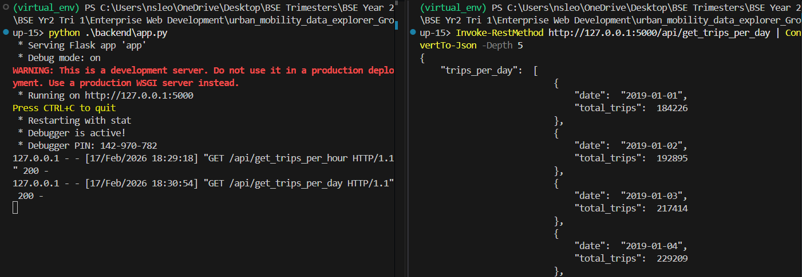
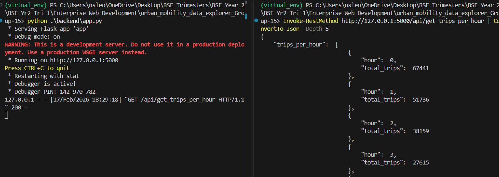
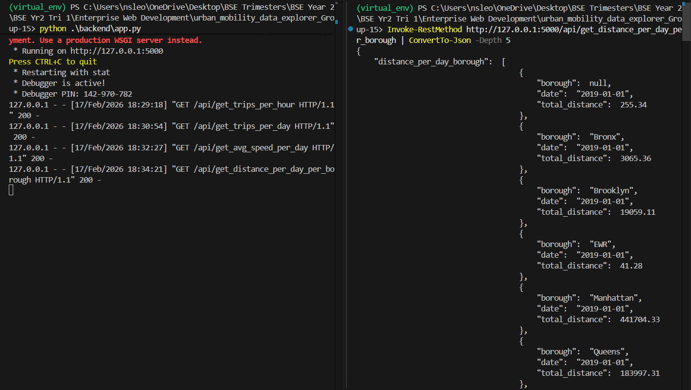
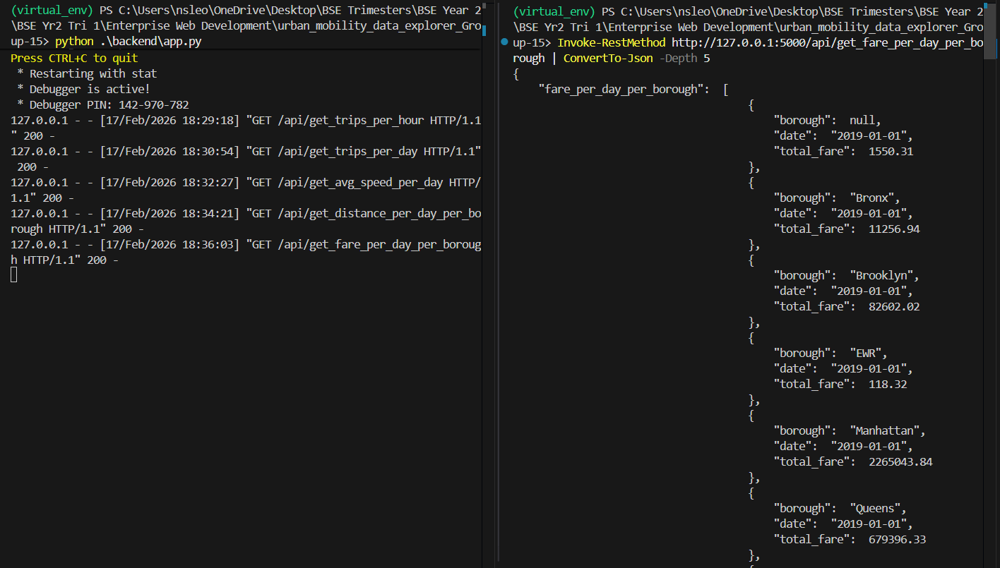
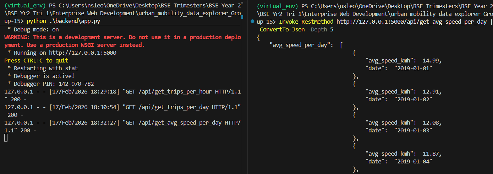
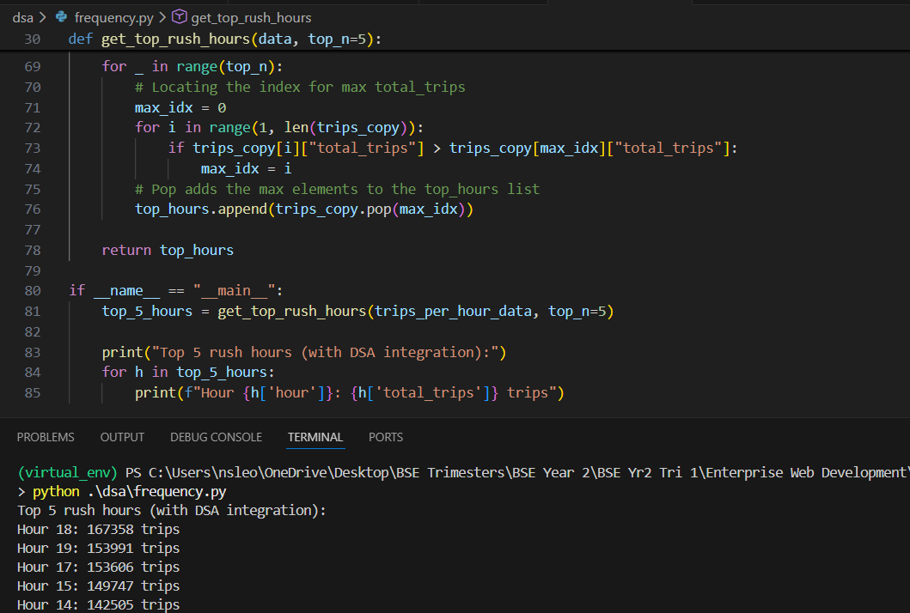

<h1 align="center"> 📝 API DOCUMENTATION </h1>

## 1. GET /get_trips_per_day
<li>Description - Retrieves dates and the corresponding total number of trips from all boroughs </li>
<li>CURL Request with WSL - curl -X GET http://127.0.0.1:5000/get_trips_per_day </li>
<li>CURL Request with Powershell - Invoke-RestMethod http://127.0.0.1:5000/api/get_trips_per_day | ConvertTo-Json -Depth 5 </li>
 

<li>Status Codes</li>
i. 200 - OK  
ii. 404 - Incorrect endpoint

 

## 2. GET /get_trips_per_hour
<li>Description - Retrieves hours and the corresponding total number of trips from all boroughs </li>
<li>CURL Request with WSL - curl -X GET http://127.0.0.1:5000/get_trips_per_hour </li>
<li>CURL Request with Powershell - Invoke-RestMethod http://127.0.0.1:5000/api/get_trips_per_hour | ConvertTo-Json -Depth 5 </li>
 

<li>Status Codes</li>
i. 200 - OK  
ii. 404 - Incorrect endpoint

 

## 3. GET /get_distance_per_day_per_borough
<li>Description - Retrieves total distances covered on specific days from each borough </li>
<li>CURL Request with WSL - curl -X GET http://127.0.0.1:5000/get_distance_per_day_per_borough </li>
<li>CURL Request with Powershell - Invoke-RestMethod http://127.0.0.1:5000/api/get_distance_per_day_per_borough | ConvertTo-Json -Depth 5 </li>
 

<li>Status Codes</li>
i. 200 - OK  
ii. 404 - Incorrect endpoint

 

## 4. GET /get_fare_per_day_per_borough
<li>Description - Retrieves total fare amount collected on specific days from each borough </li>
<li>CURL Request with WSL - curl -X GET http://127.0.0.1:5000/get_fare_per_day_per_borough </li>
<li>CURL Request with Powershell - Invoke-RestMethod http://127.0.0.1:5000/api/get_fare_per_day_per_borough | ConvertTo-Json -Depth 5 </li>
 

<li>Status Codes</li>
i. 200 - OK  
ii. 404 - Incorrect endpoint

 

## 5. GET /get_avg_speed_per_day
<li>Description - Retrieves average speed vehicles from all boroughs travelled at on specific days </li>
<li>CURL Request with WSL - curl -X GET http://127.0.0.1:5000/get_avg_speed_per_day </li>
<li>CURL Request with Powershell - Invoke-RestMethod http://127.0.0.1:5000/api/get_avg_speed_per_day | ConvertTo-Json -Depth 5 </li>
 

<li>Status Codes</li>
i. 200 - OK  
ii. 404 - Incorrect endpoint

 

## 6. DSA INTEGRATION
<li>Description - Retrieves the top 5 busiest hours for taxis (rush hours) </li>
 

 

